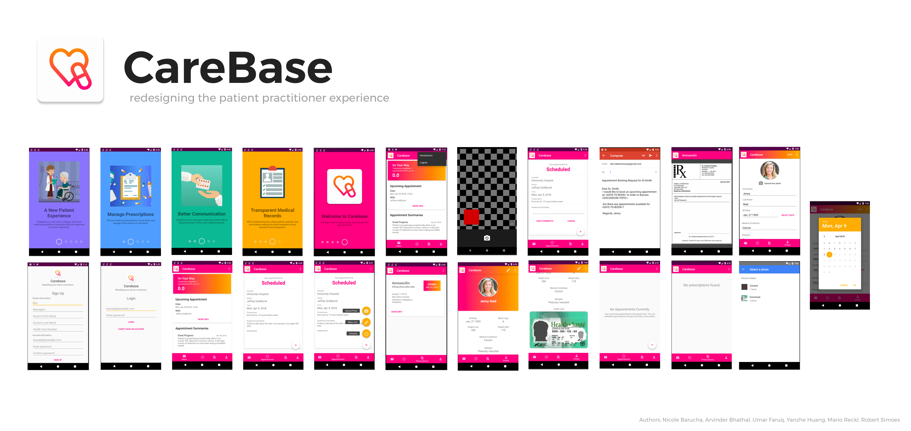

# CareBase

The patient-doctor’s office interaction for patients dealing with the process of cancer treatment, remission, and relapse is very stressful. 

There are few dedicated digital mediums for communicating progress, summaries, recommendations for the treatment leading to decreased transparency of experience, and inefficiencies in managing related information.

CareBase is a new mobile application poised to overcome the barriers and anxiety felt by all parties managing the stressful process of cancer treatment.

## Build & Usage

**Note**: As this is open source, the CareBase backend Firebase project for this app does not exist. The `google-service.json` provided in the application does not exist. If you want to clone and repurpose this app please create your own firebase project and add the relevant `google-services.json` file.

### Demo
*Use the Demo Account* to Explore the App.

### How CareBase is Used
CareBase is designed to be an application used by both patients and health-care practitioners. As such, some features of CareBase such as creating Appointments, Prescriptions, and Summaries are meant to be created by the practitioner side of things.

## Team

Nicole Barucha, Arvinder Bhathal, Umar Faruq, Yanzhe Huang, Mario Reckl, Robert Simoes

## Licence

CareBase is licenced under Apache 2.0. 

All assets belong to their respective creators, sourced to from Creative Commons repositories. Credits to Vecteezy, FreePik, FreeIcon, and Google Material Deisgn. 
